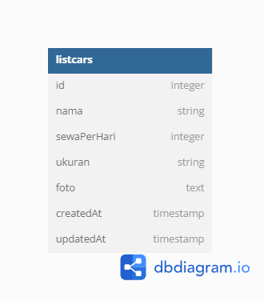

# Challenge 4 MSIB Binar Academy

## Database Structure

<p align="center" width="100%">
     
</p>

## Installation

- Clone This Repository
- `npm i`
- `npm run dev`

## API Reference

#### Get default router

```http
  GET http://localhost:3000/
```

#### Get create listcar page

```http
  GET /api/v1/listcars/create
```

#### Get all listcars

```http
  GET /api/v1/listcars/all
```

#### Create car

```http
  POST /api/v1/listcars/admin/create
```

#### Update car

```http
  POST /api/v1/listcars/admin/edit/:id
```

#### Delete car

```http
  POST /api/v1/listcars/delete/:id
```


<h1 align="center">
  Submission Chapter 4
</h1>

# Data Diri
|  |  |
|--|--|
| ID Peserta | **FSW2402KM6020** |
| Nama Peserta | **Reinanda Faris** |
|  |  |  - 
| Kelas | FSW 1 |
|  |  |
| ID Fasil | **F-FSW24001086** |
| Nama Fasilitator | **Imam Taufiq Hermawan** |

# Fullstack Web Development
### KM x Binar Academy Batch 6
|  |
|--|
| **Catatan** |
| Chapter 4 - Submission NODEJS_CRUD_SEQUELIZE - EXPRESSJS|
